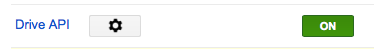
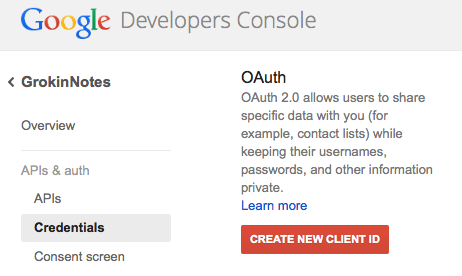
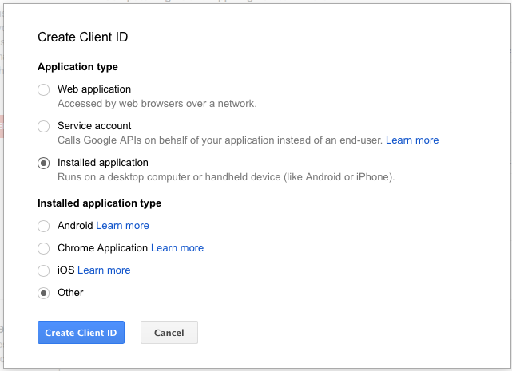
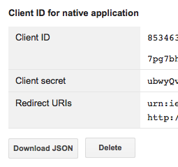

### Setting up DriveSDK Credentials

1. Go to the [Google Developers](https://cloud.google.com/console) Console.
2. Select a project.
3. In the sidebar on the left, select `APIs & auth`.
4. In the displayed list of APIs, make sure the `Drive API` status is set to `ON`.  

5. From the left menu select `Credentials` then `CREATE NEW CLIENT ID`:  
  
6. From the `Create Client ID` dialog, choose `Installed Application` and `Other`, then
`Create Client ID`:  
  
7. The new `Client ID` and `Client secret` are now available to add to your configuration.  
  
